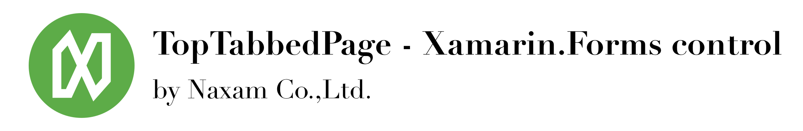
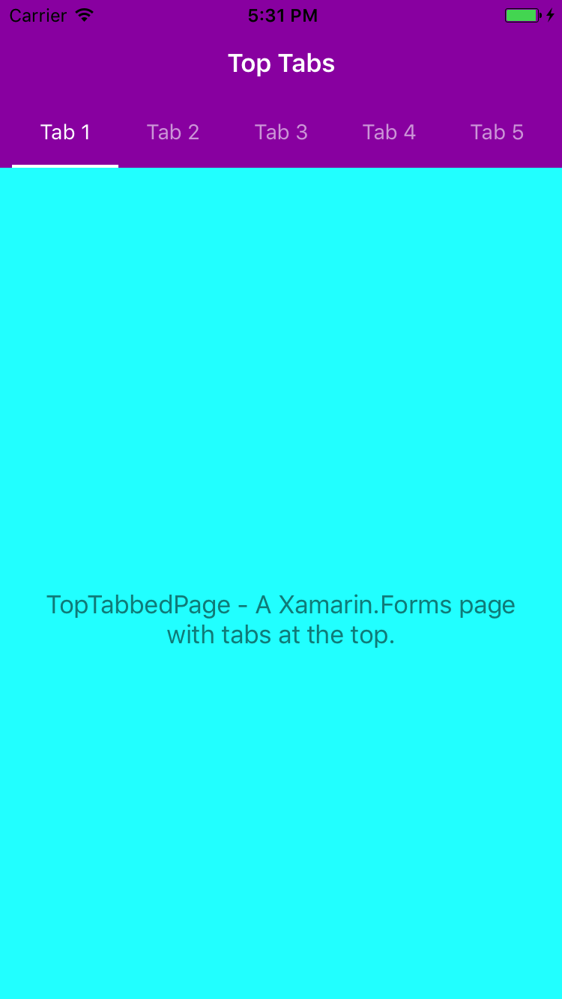
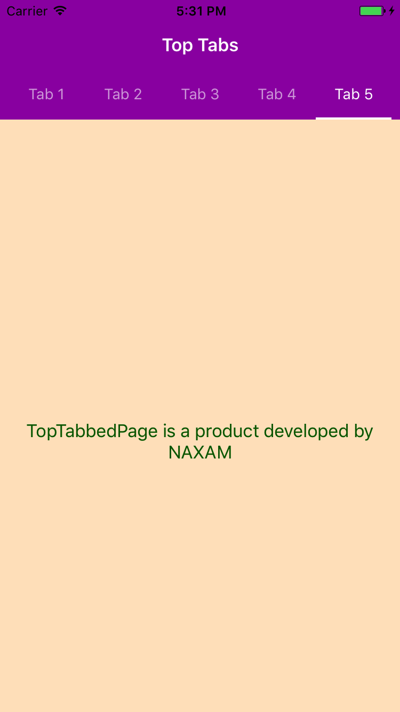

# TopTabbedPage

A Xamarin.Forms page based TabbedPage to show tabs at top on iOS.

|||
|:---:|:---:|


## About
This project is maintained by Naxam Co.,Ltd.<br>
We specialize in developing mobile applications using Xamarin and native technology stack.<br>

**Looking for developers for your project?**<br>

<a href="mailto:tuyen@naxam.net"> 
</a> <br>

## Installation

    Install-Package Naxam.TopTabbedPage.Forms

## Usage
This control is used the same as standard tabbed page, except it has one more options to set selected tab indictor color, `BarIndicatorColor`.

```xml
<forms:TopTabbedPage
    xmlns="http://xamarin.com/schemas/2014/forms"
    xmlns:x="http://schemas.microsoft.com/winfx/2009/xaml"
    x:Class="Naxam.Demo.TestPage"
    xmlns:views="clr-namespace:Naxam.Demo"
    xmlns:forms="clr-namespace:Naxam.Controls.Forms;assembly=Naxam.TopTabbedPage.Forms"
    BarTextColor="#00b9e1"
    BarIndicatorColor="#00b9e1"
    BarBackgroundColor="#ffffff"
    Title="MyRide">
    <views:Page1 />
    <views:Page2 />
</forms:TopTabbedPage>
```

## Credits
This library currently uses `MDTabBar` from [MaterialControls](https://github.com/fpt-software/Material-Controls-For-iOS) library.

## License

TopTabbedPage is released under the Apache License license.
See [LICENSE](./LICENSE) for details.
